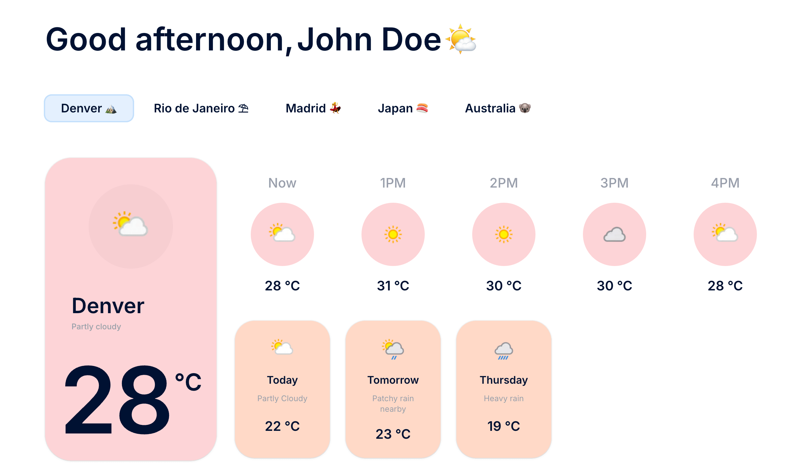

# Weather App

Modernized weather app prototype using:

- Vue 3 + TypeScript
- Vite
- Tailwind CSS v4
- ESLint
- Prettier
- TanStack Query



## Scripts

- `npm run dev` – start dev server
- `npm run build` – production build
- `npm run preview` – preview production build
- `npm run lint` – run ESLint on all source files
- `npm run lint:fix` – attempt automatic ESLint fixes
- `npm run format` – run Prettier write across the repo
- `npm run type-check` – strict TypeScript project check via vue-tsc
- `npm run test` – run unit tests once in CI mode
- `npm run test:watch` – run unit tests in watch (dev) mode
- `npm run deploy:preview` – deploy a preview build to Vercel (creates/updates a preview environment)
- `npm run deploy` – deploy a production build to Vercel (`--prod`)

## Structure

```
├─ index.html           # App mount point
├─ src/
│  ├─ api/              # Data access (e.g. clients, fetch helpers)
│  ├─ queries/          # Data fetching hooks / TanStack Query definitions
│  ├─ components/       # Reusable / feature UI components
│  ├─ config/           # Static app/domain configuration (barrel exported)
│  ├─ models/           # Shared TypeScript model & domain types
│  ├─ utils/            # Pure utility helpers (date, color, etc.)
│  ├─ styles.css        # Global styles + Tailwind design tokens
│  └─ App.vue           # Root component (composition + layout shell)
├─ public/              # Static assets served as‑is
├─ docs/                # Documentation (CONVENTIONS, screenshots, etc.)
├─ .env.sample          # Sample environment variables
└─ tests (inline *.spec.ts near sources) # Unit tests colocated with code
```

## Design Tokens

Defined in `src/styles.css` under `@theme`: colors, radii, spacing, fonts, container widths.

## Formatting & Linting

- Prettier config at `prettier.config.js`
- ESLint config `eslint.config.js`

## Environment Configuration

Environment variables follow Vite's `import.meta.env` convention. Only checked-in example is `.env.sample` (safe to commit). Runtime private values belong in local (ignored) env files.

Variables used:

- `VITE_WEATHERAPI_KEY` – WeatherAPI key (client-exposed; treat with care)

`.env.local` is for local development only and is **git ignored**. Use platform-specific secrets in production deploys.

## State & Data Management

TanStack Query powers the data layer:

- Declarative async queries + mutations
- Smart caching & de-duplication
- Stale / fresh lifecycle management (staleTime, refetch rules)
- Background refetching & automatic updates
- Built-in loading / error state orchestration

#### Why no Pinia?

Pinia was considered for global state, but current requirements are almost entirely server-data centric (weather lookups, timelines). TanStack Query already supplies:

- Cache normalization per query key
- Automatic stale invalidation
- Optimistic update patterns (if needed later)

Introducing Pinia now would add boilerplate without clear benefit. If future purely client-derived global state (e.g. user preferences, theming persistence beyond simple local storage) expands, Pinia can be layered in incrementally.

## Development

1. Install dependencies:
   ```bash
   npm install
   ```
2. Create your local env file (dev only):
   ```bash
   cp .env.sample .env.local
   # edit .env.local and set
   # VITE_WEATHERAPI_KEY=YOUR_REAL_KEY
   ```
3. Start dev server:
   ```bash
   npm run dev
   ```
4. Open the printed local URL (default: http://localhost:5173).

For production: configure the variable in your hosting provider's environment (do not commit `.env.local`).

## Deployment (Vercel)

> Prerequisites: Ensure the `VITE_WEATHERAPI_KEY` environment variable is configured in Vercel (Production + Preview) **before** running any deploy script. Without it the build will succeed but runtime requests will fail.

The project is Vite-based and deploys cleanly on Vercel.

Steps:

1. Push repository to GitHub (or GitLab/Bitbucket) – main branch auto‑deploys by default.
2. In Vercel dashboard: New Project → Import the repo.
3. Framework preset: detect automatically (Vite). If not:
   - Build Command: `npm run build`
   - Output Directory: `dist`
4. Set Environment Variables (Settings → Environment Variables):
   - Name: `VITE_WEATHERAPI_KEY`
   - Value: your WeatherAPI key
   - Environments: check Production, Preview, and Development if you use Vercel preview URLs.
5. (Optional) Add a protection: rotate the key if it has been exposed locally previously.
6. Trigger a deploy (Vercel will build and serve `dist`).

CLI deploys:

- First authenticate (once): `npx vercel login`
- Preview: `npm run deploy:preview` (creates a preview URL)
- Production: `npm run deploy` (promotes build to production)

If you update or add env vars after initial setup:

- Set them in Vercel dashboard
- (Optional) Pull locally with: `vercel env pull .env.local`
- Redeploy using the appropriate script

Notes:

- Vite exposes any variable starting with `VITE_` to client code; treat the key as quota‑bounded (not a true secret).
- Do NOT upload `.env.local`; rely on Vercel's encrypted store.
- When rotating the key: update Vercel → redeploy → update local `.env.local` for parity.
- If you add additional env variables later, redeploy is required for them to appear in the build.

Local production preview:

```bash
npm run build && npm run preview
```

## Tests

The test stack uses:

- `vitest` (runner + assertion)
- `@vue/test-utils` (component mounting utilities)
- `jsdom` (DOM environment simulation)

Conventions:

- Test files are colocated with the code they verify (same directory)
- Naming: `ComponentName.spec.ts` or `utilityName.spec.ts`
- Prefer `test()` over `describe()/it()`; only introduce `describe()` blocks for grouping a very specific subset of behavior
- Keep helpers minimal (e.g. a local `setup()` factory per spec when needed)

Scripts:

```bash
npm run test        # single run (CI friendly)
npm run test:watch  # watch mode during development
```

Add new tests by creating a `*.spec.ts` beside the target component or module. Avoid deep directory structures for tests to keep proximity and reduce cognitive overhead.

## Planned Work (TO DO)

- Introduce E2E testing (e.g. Playwright) for critical user flows
- Add integration tests covering component interaction + data fetching boundaries
- Expand utility and component test coverage
- Introduce fixtures & API mocking (evaluate `msw` for network interception and realistic mocks)
- Potential: coverage thresholds & CI reporting once suite matures
- Improve client-side state management for non-server data (e.g. user prefs, UI state) — evaluate introducing Pinia alongside TanStack Query
- Improve error management (graceful fallback UI, retry affordances, centralized handling)
- Add toast/notification component for user-friendly success & error messages (API failures, stale data refresh)
- Evaluate using local optimized weather icons from `public/images` instead of remote API icons (consistency, performance, offline resiliency)
